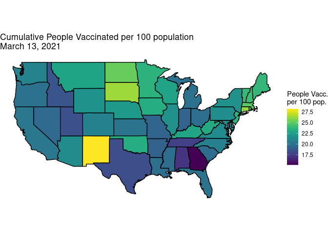

You should submit a knitted pdf file on Moodle, but be sure to show all
of your R code, in addition to your output, plots, and written
responses.

## Web scraping

1.  Read in the table of data found at the link
    [here](https://en.wikipedia.org/wiki/List_of_United_States_cities_by_population)
    and create a scatterplot of land area versus the 2019 estimated
    population. Additionally, do necessary tidying: get rid of
    extraneous information in the cells, parse columns into the proper
    format, etc. A few things to look for:

-   The function `as_tibble` may be helpful, but you’ll want to make
    sure there’s no duplicate variable names before converting a data
    set into a tibble.
-   Use variable names that don’t require single quotes.
-   Be sure variables in your tibble are of proper type.
-   Remove footnotes in square brackets from city names.
-   Print out your tidy tibble in addition to your plot.

Further hints:

-   if you want, you can delete the land area column and the population
    density column with km2, since (a) it’s a bear that they both have
    the same name in wikipedia, and (b) once you know sq miles, you can
    always convert to km2. You can also delete the location column if
    you want. Thus, your cleaned data set should have a minimum of 314
    rows and 8 columns.
-   note that if you do parse\_number(Change), it turns everything
    positive. See if you can clean the Change column and still preserve
    the negatives.
-   str\_replace or str\_remove can be helpful in removing footnotes
    \[.\]

Hello! I’m making a change!

    2 + 2

    ## [1] 4

Now I’m making a change from GitHub!!!

1.  Following the examples from class, use the `rvest` package to pull
    off data from the link
    [here](https://www.imdb.com/search/title?year=2018-01-01,2018-12-31&sort=boxoffice_gross_us,desc)
    with the top 50 grossing films from 2018. Generate a tibble that
    contains the title, gross, star rating (imdbscore), and metascore
    for the top 50 films. Then create a scatterplot of star rating
    versus Gross. A couple of hints:

-   use SelectorGadget
-   use tibble(var1, var2, var3, var4) to put together individual
    vectors of values into a single tibble with 4 columns

1.  Identify which films of the top 50 from 2018 had the biggest
    discrepancy between reviewers (metascore) and viewers (star rating).

2.  5 points if you push your Rmd file with HW15 solutions along with
    the knitted pdf file to your MSCS264-HW15 repository in your GitHub
    account. So that I can check, make your repository private (good
    practice when doing HW), but add me (username = lfbv) as a
    collaborator under Settings &gt; Collaborators.

## Map example

    vaccine_data <- read_csv("Data/exam1data.csv") 

    ## 
    ## ── Column specification ────────────────────────────────────────────────────────
    ## cols(
    ##   State = col_character(),
    ##   Date = col_date(format = ""),
    ##   people_vaccinated = col_double(),
    ##   total_distributed = col_double(),
    ##   share_doses_used = col_double(),
    ##   people_vaccinated_per100 = col_double(),
    ##   Governor = col_character(),
    ##   Region = col_character(),
    ##   month0 = col_double(),
    ##   day0 = col_double(),
    ##   year0 = col_double(),
    ##   est_population = col_double(),
    ##   dist_per_person = col_double(),
    ##   prev_day = col_double(),
    ##   daily_vaccinated = col_double()
    ## )

    vacc_mar13 <- vaccine_data %>%
      filter(Date =="2021-03-13") %>%
      select(State, Date, people_vaccinated_per100, share_doses_used, Governor) %>%
      mutate(State = str_replace(State, " State", ""),
             State = str_to_lower(State))

    library(viridis) # for color schemes

    ## Loading required package: viridisLite

    library(maps)

    ## 
    ## Attaching package: 'maps'

    ## The following object is masked from 'package:purrr':
    ## 
    ##     map

    map_data("state") %>%
      left_join(vacc_mar13, by =c("region" = "State")) %>%
      ggplot(mapping = aes(x = long, y = lat,
                              group = group)) + 
      geom_polygon(aes(fill = people_vaccinated_per100), color = "black") + 
      labs(fill = "People Vacc.\nper 100 pop.") +
      coord_map() + # This scales the longitude and latitude so that the shapes look correct.
      theme_void() + # This theme can give you a really clean look! 
      scale_fill_viridis() + # you can change the fill scale for different color schemes.
      labs(title = "Cumulative People Vaccinated per 100 population\nMarch 13, 2021")

